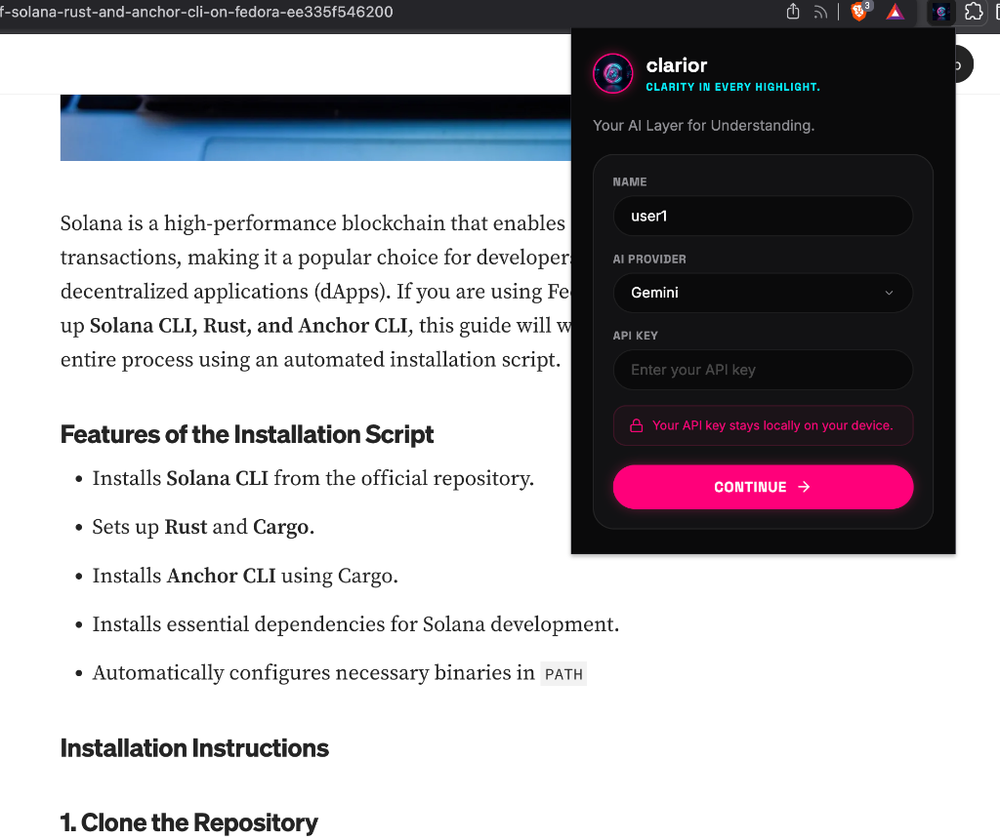
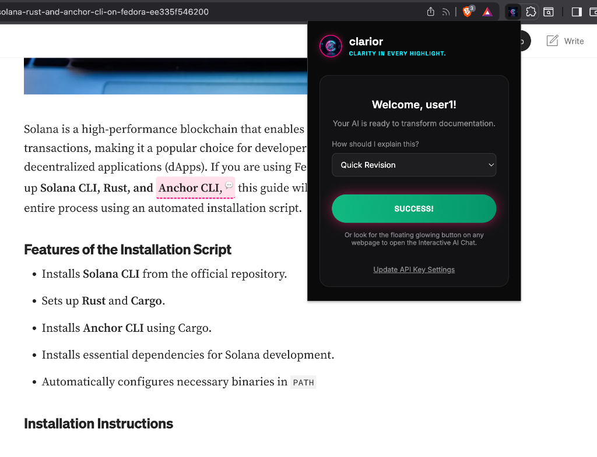
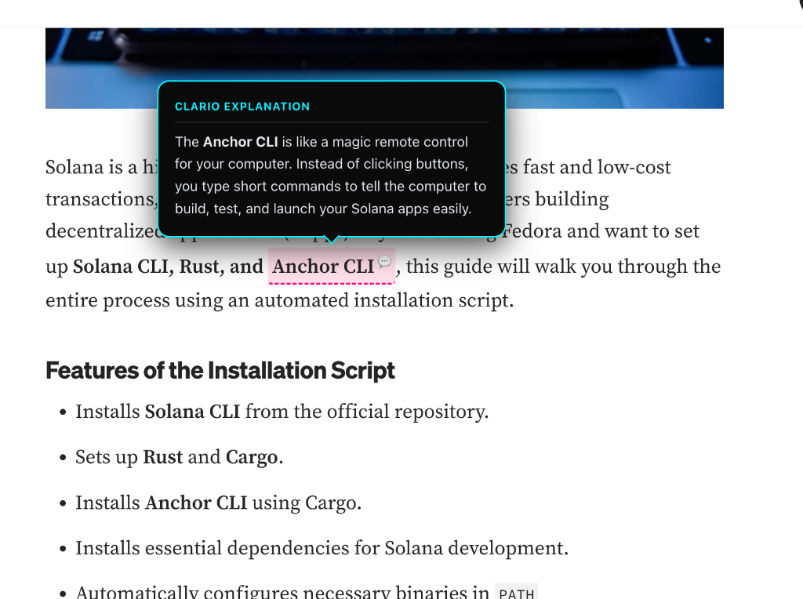
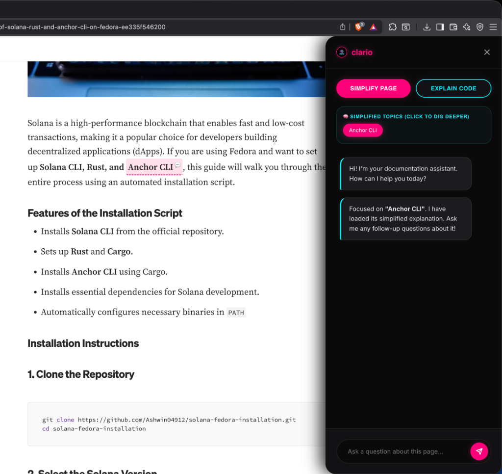

# CLARIYOR
### **Clarity in Every Highlight.**
*Your AI Layer for Understanding.*

---

**clariyor** is a premium, state-of-the-art Chrome Extension designed to eliminate documentation friction. When reading complex API docs, guides, or codebases, developers often run into confusing jargons, convoluted explanations, and dense paragraphs. **clariyor** embeds an intelligent, non-destructive explanation layer right into your browser.

With **clariyor**, you can instantly highlight any word, jargon, or paragraph to obtain clean, context-focused simplifications, and launch interactive deep-dives inside a gorgeous **Neon Noir** styled workspace.

---

## ✨ Features

*   **🪄 Jargon & Sentence Simplification**: Highlight any technical term, API name, or complex sentence. A floating, black-pill outline trigger appears; clicking it displays a beautifully formatted definition without ever leaving the page.
*   **🧠 "Dig Deeper" Focus Mode**: As you simplify jargon on a page, **clariyor** automatically lists them in a dedicated interactive list inside your sidebar. Click a topic pill to lock the AI's focus onto that specific topic and ask context-aware follow-up questions.
*   **💬 Interactive Neon Noir Sidebar**: A robust, context-aware chatbot overlay designed with vibrant cyber-gradients. Chat with the AI using the entire page content or targeted topic definitions as reference context.
*   **🎨 Custom Audience Tuning**: Choose between **Beginner Level** (explain like I'm 5, use analogies), **Quick Revision** (bullet points & takeaways), and **Very Concise** (executive summary) to customize explanations to your skill level.
*   **🔒 Local-First API Keys**: Your Google Gemini API keys are validated and stored locally on your device using the secure `chrome.storage` API. No server middle-men.

---

## 📸 Screenshots

Here is **clariyor** in action:

| 1. Dashboard Welcome Screen | 2. API Validation Success |
|:---:|:---:|
|  |  |

| 3. Inline Jargon & Sentence Simplifier | 4. Interactive Sidebar Chat & "Dig Deeper" Focus Mode |
|:---:|:---:|
|  |  |

---

## 🛠️ Installation & Setup

1.  **Clone or Download** this repository to your local device.
2.  Open **Google Chrome** and navigate to: `chrome://extensions/`.
3.  Enable **Developer Mode** by toggling the switch in the top-right corner.
4.  Click on **Load unpacked** in the top-left and select the `/ai_doc_extension` root directory.
5.  Pin **clariyor** to your browser toolbar!
6.  Click the glowing **clariyor** logo, enter your name, add your Gemini API key, and hit **Continue** to start learning with absolute clarity.

---

## 🔑 Generating a Gemini API Key from Google AI Studio

To power **clariyor**, you will need a free Gemini API key from Google AI Studio:

1. Go to [Google AI Studio](https://aistudio.google.com/).
2. Sign in with your Google Account.
3. Click the **Get API key** button in the top-left or center dashboard.
4. Click **Create API key**.
5. Select a Google Cloud project (or let it auto-create a new one) and click **Create API key in existing project**.
6. Copy your generated key and paste it directly into the **clariyor** popup setup screen!

---

## 🚀 How to Use

Once **clariyor** is loaded and your Gemini API key is configured, you're ready to read documentation with ease!

### 1. 🪄 Highlight & Simplify
*   **Highlight any sentence or complex paragraph** on any web page.
*   Click the **floating message icon** that appears above your selection.
*   An instant, beautifully styled inline tooltip will explain/simplify the content matching your selected level (e.g. Beginner Level, Quick Revision, etc.).

### 2. 📖 Double-Click Jargon
*   **Double-click any single word** (like a technical term or jargon) on a web page.
*   An instant dictionary definition box will appear to define the term clearly in 1 or 2 sentences.

### 3. 💬 Open the Interactive Chat
*   Click the **glowing launcher button** in the bottom-right corner of any page.
*   The **clariyor interactive sidebar** will slide open, loaded with a chat interface to ask follow-up questions.

### 4. 🧠 "Dig Deeper" Focus Mode
*   Inside the sidebar under the **"Dig Deeper"** section, you will see a list of all technical topics/jargon you have simplified so far on this page.
*   **Click any topic pill** to lock the AI's focus. The AI will load the topic context, allowing you to ask hyper-specific, deep questions to master the concept!

---

## 🤝 Contributing

If you find any bugs, issues, or improvement ideas while using clariyor, feel free to open an issue on GitHub. Your feedback and contributions are truly valuable and help make clariyor better for everyone. 🚀

Whether it’s fixing a bug, suggesting a feature, improving UI/UX, or contributing code — every contribution matters. So do contribute and be part of building clariyor together.

---

## ☕ Support clariyor

If you love using **clariyor** and want to support its ongoing development, feel free to support the developer directly! It keeps the lights on and the neon glowing.

  

